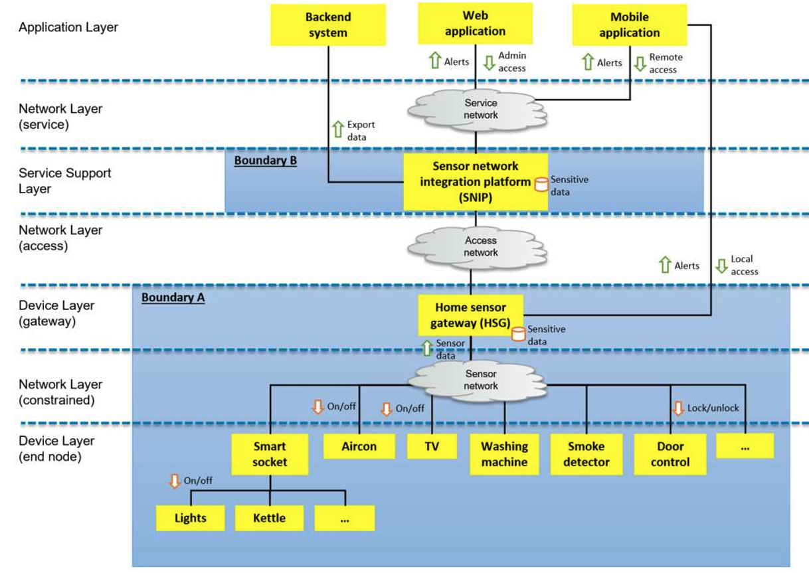

# **IMDA 資訊通信媒體發展局**

**物聯網 (IoT) 網絡安全指南 附錄 B**

**家庭控制系統案例研究**

**物聯網 (IoT) 網絡安全指南 附錄 B 版本 1，2019 年 1 月**

資訊通信媒體發展局  
10 Pasir Panjang Road  
\#03-01 Mapletree Business City  
Singapore 117438  
IMDA 版權所有，2019 年  
本文件可從 IMDA 網站 http://www.imda.gov.sg 下載，未經 IMDA 書面許可，不得分發。

### **IMDA IoT 網絡安全指南 附錄 B V1（2019 年 2 月）**

### **目錄**

下表：  
「章節 (§) 家庭控制系統案例研究 頁碼」

1. 概述 3  
2. 識別保護目標 4  
3. 定義安全問題 6  
4. 進行風險評估 7  
5. 確定安全目標 9  
6. 定義安全需求 10

本指南是一份活文件，將定期進行審查和修訂。  
指南屬於參考性文件，本質上是自願性的，除非監管機構強制規定。  
它也可以在合約中被引用為強制性要求。  
建議用戶評估本指南是否適合其預期用途。  
遵守本指南並不免除用戶的任何法律義務。

### **聲明**

資訊通信媒體發展局（「IMDA」）對此處提供的材料不作任何形式的保證，並排除任何明示或暗示的保證或條件，包括不侵權、適銷性、令人滿意的品質以及特定用途的適用性。

在法律允許的最大範圍內。IMDA 不對此處包含的任何錯誤和/或遺漏負責，也不對因使用本材料而引起的任何損失或損害（包括任何利潤、業務、商譽或聲譽的損失，和/或任何特殊的、附帶的或後果性的損害）負責。

IMDA 提請注意，本指南的實踐或實施可能涉及知識產權的使用，並且對於任何此類知識產權的存在、有效性和/或適用性不持任何立場，無論是由本文件的貢獻者還是任何第三方主張。

截至本指南公開諮詢發布之日，IMDA 尚未收到任何可能與本指南實施相關的專利權書面通知。

然而，實施者應注意，這可能不代表最新資訊，因此強烈建議向國際電信聯盟 (ITU)、國際標準化組織 (ISO)、國際電工委員會 (IEC) 或相關標準制定組織的相關數據庫查詢專利權資訊。

如有需要，建議實施者就本指南的實施尋求自己的法律和/或技術建議。

# **附錄 B：家庭控制系統案例研究（參考性）**

## **1\. 概述**

本附錄介紹了一個關於家庭控制系統 (HCS) 的案例研究，並展示了主文件中的建議如何應用於此案例研究。

本案例研究並非詳盡無遺，範例應用程式也非 HCS 的權威定義，僅供說明之用。

表 B-1 描述了主文件中定義的威脅建模檢查表，及其在 HCS 案例研究中的應用。

### **表 B-1：威脅建模檢查表的應用**

| ID | Threat modelling checklist | Y/N | Please elaborate |
| :---- | :---- | :---- | :---- |
| **1** | **識別需要保護的潛在目標** a. 定義其邊界及需要互動的外部系統（包括用戶） b. 將目標分解為子組件 c. 識別目標內的數據流，以及來自外部系統的輸入和輸出 d. 識別敏感數據及其處理位置（靜態、傳輸中、使用中） e. 針對子組件和數據流識別安全需求（基於對機密性、完整性和可用性 (CIA) 三要素的潛在影響） f. 識別使用中的硬體、軟體和協定 | Y | 參見第 2 節 |
| **2** | **定義安全問題** a. 識別系統可訪問性   • 識別攻擊面   • 確定操作環境   • 確定系統/設備生命週期和供應鏈 b. 識別系統敏感性（即漏洞）   • 確定已知漏洞   • 列舉對攻擊面的威脅（使用欺騙、篡改、否認、資訊洩露、拒絕服務和特權提升 (STRIDE) 作為指南）   • 列舉對操作環境的威脅（使用 STRIDE 作為指南）   • 列舉對系統/設備生命週期各階段和供應鏈的威脅（使用 STRIDE 作為指南） c. 說明任何假設 | Y | 參見第 3 節 |
| **3** | **進行風險評估** • 評估威脅和漏洞對 CIA 三要素的影響，並與資產的安全需求進行匹配 • 評估實現威脅所需的攻擊者能力 • 評估風險的可能性 • 優先考慮風險以進行緩解，包括其他考量因素（例如金錢影響） | Y | 參見第 4 節 |
| **4** | **確定安全目標** • 說明安全目標。例如，OT 系統強調安全性，其中系統完整性優先於數據機密性 | Y | 參見第 5 節 |
| **5** | **定義安全需求** • 說明解決已識別安全目標所需的必要需求，而不涉及其具體實施 | Y | 參見第 6 節 |
| **6** | **設計並實施功能** | N | 本文件未涵蓋 |
| **7** | **驗證並核實功能是否充分解決了安全需求** | N | 本文件未涵蓋 |

## **2\. 識別保護目標**

本節說明威脅建模檢查表第 1 項提供的指導，該指導有助於識別 HCS 案例研究的保護目標 (TOP)。

圖 B-1 是所定義案例研究的系統架構，展示了威脅建模檢查表提供的指導。

### **圖 B-1：HCS 的系統架構**

*（註：圖表組件的文字表示）*

* **應用層：** 後端系統、網頁應用程式、行動應用程式  
* **服務支援層：** 感測器網絡整合平台 (SNIP) \[邊界 B\]  
* **網絡層（服務）：** 服務網絡  
* **網絡層（接入）：** 接入網絡  
* **設備層（網關）：** 家庭感測器網關 (HSG) \[邊界 A 開始\]  
* **網絡層（受限）：** 感測器網絡  
* **設備層（終端節點）：** 智慧插座（電燈、水壺）、冷氣機、電視、洗衣機、煙霧探測器、門控裝置

為 HCS 案例研究定義了兩個系統邊界。

邊界 A 定義為涵蓋家庭環境內的所有子組件，而邊界 B 定義為包含託管在雲端基礎設施上的感測器網絡整合平台 (SNIP)。

在邊界 A 內，定義感測器網絡基於 WiFi 連接，且家庭感測器網關 (HSG) 在感測器網絡上的設備與接入網絡上的 SNIP 之間進行協調。

HSG 可能託管敏感數據。HSG 聚合來自連接設備的感測數據，也可以向允許控制的設備發送指令。

HSG 允許授權用戶存取其連接的設備並發出指令，既可以透過服務網絡（網際網路或專用網絡）遠端進行，也可以在家庭內部本地進行（例如使用 WiFi 連接）。

HSG 也可以在本地模式下運作，此時接入網絡不可用。

連接到智慧插座的設備（電燈和水壺）不是智慧設備。

電燈透過與智慧插座的配對機制啟用控制。我們將水壺定義為不允許控制。

SNIP 是一個數位平台，聚合來自多個家庭的多個網關的感測數據，並可能託管敏感數據。

它連接到企業後端系統，並可能出於各種目的（例如存檔）批量匯出數據。

SNIP 支援網頁和行動介面，用於操作和管理目的。

表 B-2 確定了資產在 CIA 三要素方面的安全需求。它有助於優先考慮需要保護的資產和方面。

### **表 B-2：資產的安全需求**

**圖例：H \= 高，M \= 中，L \= 低**

| 資產 | 機密性 | 完整性 | 可用性 | 理由 |
| :---- | :---- | :---- | :---- | :---- |
| **感測器網絡整合平台 (SNIP)** | H | H | H | 機密性為高，因為 SNIP 包含敏感數據。完整性為高，以保護指令調用。可用性很重要，因為需要支援許多用戶。 |
| **家庭感測器網關 (HSG)** | H | H | M | 機密性和完整性與 SNIP 相同。可用性為中等，因為僅影響一個家庭。 |
| **設備：冷氣機** | L | M | L | 完整性相對更重要，因為當冷氣機應關閉卻開啟時會有金錢影響。 |
| **設備：電視** | M | H | L | 完整性為高，因為受損的電視可能參與 DDoS 攻擊。機密性為中等，因為觀看習慣的洩露可能影響隱私。 |
| **設備：洗衣機** | L | L | L |  |
| **設備：煙霧探測器** | L | H | M | 完整性為高，以獲得急救人員對系統的信任。 |
| **設備：門控裝置** | M | H | H | 完整性和可用性對於此設備的正常運作非常重要。由於此設備不包含敏感數據，機密性為中等，因為我們仍希望儘可能保密活動資訊。 |
| **設備：智慧插座** | L | H | M | 出於安全考量，完整性為高。可能適用額外的限制。例如，當連接水壺時，不允許遠端存取。 |
| **設備：電燈** | L | M | M | 完整性和可用性為中等，因為照明的重要性取決於情境。例如，夜間使用燈光。 |
| **設備：水壺** | L | H | L | 出於安全考量，完整性為高。 |

表 B-3 確定了資產之間數據流在 CIA 三要素方面的安全需求。它提供了有關哪些數據流需要關注以及所需安全類型的資訊。

### **表 B-3：數據流的安全需求**

**圖例：H \= 高，M \= 中，L \= 低**

| 數據流 | 機密性 | 完整性 | 可用性 | 理由 |
| :---- | :---- | :---- | :---- | :---- |
| **設備 → HSG** | M | H | H | 此數據流對 CIA 三要素的影響是使用高水位線法（high watermark method），根據同一感測器網絡上設備的安全需求確定的。 |
| **HSG ↔ SNIP** | H | H | H | 此數據流對 CIA 三要素的影響是使用高水位線法，根據 SNIP 和 HSG 的安全需求確定的。 |
| **SNIP → 後端系統** | H | H | L | SNIP 匯出數據以在後端系統備份。相對於可用性，保護匯出數據的機密性和完整性更為重要。 |
| **網頁應用程式 ↔ SNIP → HSG → 設備** | H | H | H | SNIP 和設備的管理需要高度的機密性和完整性。警報需要高可用性。 |
| **行動應用程式 ↔ SNIP → HSG → 設備** | H | H | H | 透過 SNIP 遠端存取設備需要高度的機密性和完整性。警報需要高可用性。 |
| **行動應用程式 ↔ HSG → 設備** | M | H | M | 出於安全考量，透過 HSG 本地存取設備需要高完整性。機密性為中等，因為此數據流屬於交易性質且不敏感。警報需要中等可用性。 |

## **3\. 定義安全問題**

本節說明威脅建模檢查表第 2 項提供的指導，該指導有助於定義 HCS 案例研究的安全問題。

表 B-4 識別了導致保護目標 (TOP) 下資產的系統可訪問性和系統敏感性的關注點。它提供了定義安全問題所需的資訊（威脅、漏洞、操作環境、假設等）。

### **表 B-4：系統可訪問性和敏感性**

**資產：感測器網絡整合平台 (SNIP)**

* **系統可訪問性（攻擊面、操作環境、生命週期）：**  
  * 以下攻擊面與 SNIP 相關：批量 API、網頁 API、行動 API、HTTP/IP、儲存軟硬體、記憶體、虛擬機 (VM)、作業系統 (OS)、韌體、伺服器軟體。  
  * 假設 SNIP 託管在雲端並可從網際網路存取。  
  * 需要考慮系統生命週期的所有階段。  
* **系統敏感性（已知漏洞、STRIDE）：**  
  * 請參閱「OWASP 十大應用程式安全風險」。  
  * 從知名的漏洞資料庫掃描相關的已知漏洞。例如：[https://cve.mitre.org](https://cve.mitre.org)

**資產：家庭感測器網關 (HSG)**

* **系統可訪問性：**  
  * 以下攻擊面與 HSG 相關：管理 API、行動 API、HTTP/IP、WIFI、儲存軟硬體、記憶體、虛擬機 (VM)、作業系統 (OS)、韌體、中介軟體、通訊埠、設備 ID。  
  * 假設使用 WIFI 連接。  
  * 假設 HSG 在家庭環境中運作並可從網際網路存取。  
  * 需要考慮設備生命週期的所有階段。  
* **系統敏感性：**  
  * 請參閱「OWASP IoT 攻擊面區域」和「OWASP IoT 漏洞」。  
  * 從知名的漏洞資料庫掃描相關的已知漏洞。

**資產：設備：冷氣機**

* **系統可訪問性：**  
  * 以下攻擊面與冷氣機相關：用於感測/致動的 API、WiFi、韌體、設備 ID。假設使用 WIFI 連接。  
  * 假設冷氣機在家庭環境中運作，且僅可透過 HSG 存取。  
  * 需要考慮設備生命週期的所有階段。  
* **系統敏感性：**  
  * 請參閱「OWASP IoT 漏洞」。  
  * 從知名的漏洞資料庫掃描相關的已知漏洞。

**資產：設備：電視**

* **系統可訪問性 / 敏感性：**  
  * 與 HSG 有類似的關注點。  
  * （註：通常涉及網頁應用程式，增加攻擊面。在家庭環境中運作，有物理存取風險。）  
  * 請參閱「OWASP 行動裝置十大風險」。

**資產：設備：洗衣機、煙霧探測器、門控裝置、智慧插座**

* **系統可訪問性 / 敏感性：**  
  * 與冷氣機有類似的關注點。

**資產：設備：電燈**

* **系統可訪問性：**  
  * 與電燈相關的攻擊面是設備 ID，因為其「智慧功能」是由連接的智慧插座提供的。  
* **系統敏感性：**  
  * 電燈與智慧插座之間配對過程的漏洞。

**資產：設備：水壺**

* **系統可訪問性 / 敏感性：**  
  * 與電燈有類似的關注點。

## **4\. 進行風險評估**

本節說明威脅建模檢查表第 3 項提供的指導，該指導指引如何對 HCS 案例研究進行風險評估。

### **表 B-5：系統可訪問性和敏感性評估**

**圖例：H \= 高，M \= 中，L \= 低**

| 資產 | 系統可訪問性 | 系統敏感性 | 理由 |
| :---- | :---- | :---- | :---- |
| **SNIP** | H | H | 系統可訪問性為高，因為它託管在網際網路上。系統敏感性為高，因為存在許多已知漏洞。請參閱「OWASP 十大應用程式安全風險」。 |
| **HSG** | H | H | 系統可訪問性高。HSG 需支援多種網絡和連接，增加攻擊面。在家庭運作有物理存取風險。生命週期可能轉移所有權。系統敏感性高，因為有許多已知漏洞。 |
| **冷氣機** | M | M | 假設使用無線連接。 |
| **電視** | H | H | 託管網頁應用程式增加攻擊面。家庭環境有物理存取風險，可能轉移所有權。 |
| **洗衣機** | M | M | 假設使用無線連接。 |
| **煙霧探測器** | L | L | 當使用有線連接時。 |
| **門控裝置** | M | M | 假設使用無線連接。 |
| **智慧插座** | M | M | 假設使用無線連接。 |
| **電燈** | H | M | 可訪問性高，因為它是可拆卸的。 |
| **水壺** | H | M | 可訪問性高，因為它是可拆卸的。 |

### **表 B-6：攻擊者能力評估**

圖例：H \= 高，M \= 中，L \= 低  
攻擊者能力：L：腳本小子；M：罪犯、黑客行動主義者；H：恐怖分子、國家資助者

| 資產 | 攻擊者能力 | 理由 |
| :---- | :---- | :---- |
| **SNIP** | H | 對各種攻擊者（包括具有高能力和資源的）都有價值。 |
| **HSG** | H | 對各種攻擊者（包括具有高能力和資源的）都有價值。 |
| **冷氣機** | L | 僅對腳本小子有價值。 |
| **電視** | M | 對具有中等能力和資源的各種攻擊者有價值。 |
| **洗衣機** | L | 僅對腳本小子有價值。 |
| **煙霧探測器** | M | 對具有中等能力和資源的腳本小子和罪犯有價值。 |
| **門控裝置** | M | 對具有中等能力和資源的腳本小子和罪犯有價值。 |
| **智慧插座** | M | 對具有中等能力和資源的腳本小子和罪犯有價值。 |
| **電燈** | M | 對具有中等能力和資源的罪犯有價值。 |
| **水壺** | L | 對攻擊者沒有價值。 |

### **表 B-7：優先順序評估**

**圖例：H \= 高，M \= 中，L \= 低**

| 資產 | 系統可訪問性 | 系統敏感性 | 攻擊者能力 | 優先順序 |
| :---- | :---- | :---- | :---- | :---- |
| **SNIP** | H | H | H | **H** |
| **HSG** | H | H | H | **H** |
| **冷氣機** | M | M | L |  |
| **電視** | H | H | M | **H** |
| **洗衣機** | M | M | L |  |
| **煙霧探測器** | L | L | M |  |
| **門控裝置** | M | M | M | **H** |
| **智慧插座** | M | M | M | **H** |
| **電燈** | H | M | M |  |
| **水壺** | H | M | L |  |

## **5\. 確定安全目標**

本節說明威脅建模檢查表第 4 項提供的指導，該指導指引如何為 HCS 案例研究確定安全目標。

### **表 B-8：安全目標**

**資產：感測器網絡整合平台 (SNIP)**

* **安全目標：**  
  1. 確保敏感數據的機密性。  
  2. 確保數據和指令的機密性與完整性。  
  3. 提供適當的存取控制。  
  4. 確保系統的完整性。  
  5. 具備對抗阻斷服務 (DOS) 的韌性。  
  6. 防止多租戶技術危及安全性。

**資產：家庭感測器網關 (HSG)**

* **安全目標：**  
  1. 確保敏感數據的機密性。  
  2. 確保數據和指令的機密性與完整性。  
  3. 提供適當的存取控制。  
  4. 確保 HSG 的完整性。  
  5. 失效安全（Fail safely，指發生故障時能進入安全狀態）。  
  6. 防止多租戶技術危及安全性。

**資產：設備：電視**

* **安全目標：**  
  1. 確保數據和指令的機密性與完整性。  
  2. 確保電視的完整性。  
  3. 防止多租戶技術危及安全性。

**資產：設備：門控裝置**

* **安全目標：**  
  1. 確保數據和指令的機密性與完整性。  
  2. 提供適當的存取控制。  
  3. 確保門控裝置的完整性。  
  4. 確保可用性。

**資產：設備：智慧插座**

* **安全目標：**  
  1. 失效安全。  
  2. 確保數據和指令的完整性。  
  3. 提供適當的存取控制，包括驗證連接的設備。  
  4. 確保智慧插座的完整性。

## **6\. 定義安全需求**

本節說明威脅建模檢查表第 5 項提供的指導，該指導有助於定義 HCS 案例研究的安全需求。

### **表 B-9：供應商揭露檢查表的使用**

#### **1\. 密碼學支援**

**ID: CK-CS-01**

* **供應商揭露檢查表：** 您的設備和系統是否採用當前且業界認可的密碼學技術和最佳實踐？最佳實踐的範例包括：使用經批准的演算法、足夠的密鑰長度、使用經批准的隨機數生成器、建議的加密週期。您是否採用適當的密鑰管理（生成、交換、存儲、使用、銷毀、更換等）技術？  
* **請詳述：** 密碼學的強度對於保護機密性和完整性的目標至關重要。特別是，密碼學必須在設備的使用壽命內獲得批准。建議用於：SNIP、HSG、電視、門控裝置、智慧插座。

**ID: CK-CS-02**

* **供應商揭露檢查表：** （註：上下文暗示繼續關注密鑰管理）  
* **請詳述：** 需要適當的密鑰管理以防止密鑰在系統/設備生命週期中洩露。建議用於：SNIP、HSG、電視、門控裝置、智慧插座。

#### **2\. 安全功能保護**

**ID: CK-FP-01**

* **供應商揭露檢查表：** 您是否建立了硬體信任根 (Root-of-Trust)？  
* **請詳述：** 為了保護靜態和使用中的敏感數據（例如密鑰）的機密性和完整性。建議用於：SNIP、HSG、電視。可選用於：門控裝置、智慧插座。

**ID: CK-FP-02**

* **供應商揭露檢查表：** 您是否採用安全啟動 (secure boot)？  
* **請詳述：** 為了保護啟動過程的完整性。建議用於：SNIP、HSG、電視。

#### **3\. 識別與驗證**

**ID: CK-IA-01**

* **供應商揭露檢查表：** 您是否為客戶端（用戶、設備、網關、應用程式）和伺服器採用唯一、不可修改且可驗證的身份？  
* **請詳述：** 為了保護識別的完整性，以減輕欺騙威脅。建議用於：SNIP、HSG、電視、門控裝置、智慧插座。

**ID: CK-IA-02**

* **供應商揭露檢查表：** 您是否採用相互驗證？例如，在建立連接之前和預定義的間隔之後。  
* **請詳述：** 為了保護連接的完整性，以防止未經授權的遠端存取。建議用於：SNIP、HSG、電視、門控裝置、智慧插座。

#### **4\. 網絡保護**

**ID: CK-NP-01**

* **供應商揭露檢查表：** 您是否強制執行網絡存取控制？例如，確保加入新網絡和/或允許遠端存取的明確授權。  
* **請詳述：** 需要適當的存取控制來限制對系統網絡的存取。建議用於：SNIP、HSG、電視、門控裝置、智慧插座。

**ID: CK-NP-02**

* **供應商揭露檢查表：** 您是否採用已驗證且正確啟用安全控制的傳輸協定？範例包括：對 TCP 有效載荷使用 TLS。對 UDP 有效載荷使用 DTLS。  
* **請詳述：** 為了保護有效載荷的機密性和完整性。建議用於：SNIP、HSG、電視、門控裝置、智慧插座。

**ID: CK-NP-03**

* **供應商揭露檢查表：** 您是否採用業界最佳實踐來實現安全連接？業界最佳實踐的範例：使用 VPN 或專線。使用公共移動運營商網絡時，使用來自電信運營商的專用移動 APN。使用 DNS pinning 防止 DNS 欺騙。根據類型、端口和目的地使用流量過濾。使用憑證綁定 (Certificate pinning)。使用 MQTT 時採用 TLS。掃描開放的網絡端口。  
* **請詳述：** 適用於保護表 B.3 中強調的數據流。建議用於：SNIP、HSG、電視、門控裝置、智慧插座。

**ID: CK-NP-04**

* **供應商揭露檢查表：** 使用白名單來建立或拒絕來自不可信來源的連接。您是否將受信任端點的通訊通道與不可信端點隔離？範例包括：使用 VLAN。使用防火牆建立 DMZ。使用單向安全網關。物理隔離。  
* **請詳述：** 適用於保護表 B.3 中強調的數據流。SNIP 和 HSG 可以將管理用途的通訊通道與正常操作隔離。SNIP 應使用防火牆建立 DMZ，以防範來自設備和用戶的遠端連接。HSG 應保護家庭內的設備免受家庭外部的連接影響。建議用於：SNIP、HSG、電視、門控裝置、智慧插座。

#### **5\. 數據保護**

**ID: CK-DP-01**

* **供應商揭露檢查表：** 您是否保護敏感數據的機密性和完整性？（傳輸中、使用中、靜態）  
* **請詳述：** 為了保護敏感數據的機密性和完整性。敏感數據包括加密密鑰和用戶憑證。建議用於：SNIP、HSG、電視、門控裝置、智慧插座。

**ID: CK-DP-02**

* **供應商揭露檢查表：** 您是否保護代碼和韌體的真實性和完整性？（傳輸中、使用中、靜態）  
* **請詳述：** 為了保護 SNIP、HSG 和設備中的軟體和韌體，包括更新的傳輸。建議用於：SNIP、HSG、電視、門控裝置、智慧插座。

**ID: CK-DP-03**

* **供應商揭露檢查表：** 您是否確保數據（例如輸入、指令和感測數據）的真實性和完整性？（傳輸中、使用中、靜態）。範例包括：驗證傳入的內容類型。驗證回應類型。根據授權憑證驗證 HTTP 方法。將允許的 HTTP 方法列入白名單。定義可接受的字符集（例如 UTF-8）。驗證輸入字符是否可接受。對輸入和輸出進行編碼/轉義。  
* **請詳述：** 為了保護 SNIP、HSG 和設備中的數據，包括輸入和指令。建議用於：SNIP、HSG、電視、門控裝置、智慧插座。

**ID: CK-DP-04**

* **供應商揭露檢查表：** 您是否強制執行存取控制以檢測並防止未經授權的數據存取和外洩，並過濾您的輸出？  
* **請詳述：** 為了保護 SNIP 和 HSG 中的聚合數據免受未經授權的存取。建議用於：SNIP、HSG。

#### **6\. 存取保護**

**ID: CK-AP-01**

* **供應商揭露檢查表：** 您是否採用機制來管理和保護本地和/或遠端存取？機制範例包括：自動登出、螢幕鎖定、重複未授權嘗試後的鎖定、強制重新授權。  
* **請詳述：** 為了保護 SNIP 和 HSG 免受本地和遠端的未經授權存取，包括物理存取。建議用於：SNIP、HSG。

**ID: CK-AP-02**

* **供應商揭露檢查表：** 您是否針對重大操作和/或警報（例如憑證重置、安全更新失敗）發送帶外 (out-of-band) 通知？  
* **請詳述：** 為了讓用戶能夠透過警報檢測未經授權的嘗試。建議用於：SNIP、HSG。

**ID: CK-AP-03**

* **供應商揭露檢查表：** 您是否強制執行存取控制以防止未經授權存取系統介面、系統文件和可移動媒體？  
* **請詳述：** 為了防止對系統/設備介面的物理存取。建議用於：SNIP、HSG、電視、門控裝置、智慧插座。

**ID: CK-AP-04**

* **供應商揭露檢查表：** 您是否採用防篡改機制來進行抵抗、取證、檢測和/或回應？  
* **請詳述：** 為了防止和檢測物理篡改。建議用於：HSG、電視、門控裝置、智慧插座。

**ID: CK-AP-05**

* **供應商揭露檢查表：** 您是否支援對重大操作（例如憑證重置）進行多重驗證？  
* **請詳述：** 透過要求更高級別的驗證來保護重大操作。建議用於：SNIP、HSG、電視、門控裝置、智慧插座。

#### **7\. 安全管理**

**ID: CK-MT-01**

* **供應商揭露檢查表：** 您是否採用適當的用戶和密碼管理？範例包括：強制執行強密碼策略。強制不使用預設密碼。確保密碼恢復和重置機制是安全的。  
* **請詳述：** 為了保護對 SNIP、HSG 和電視（具有行動作業系統的設備）的存取。建議用於：SNIP、HSG、電視。

**ID: CK-MT-02**

* **供應商揭露檢查表：** 您是否對管理功能強制執行適當的存取控制？範例包括：強制執行最小權限策略。使用基於屬性的存取控制 (ABAC) 或基於角色的存取控制 (RBAC)。對密鑰管理保護實施雙重控制，以防止單一不良行為者破壞密鑰材料。對密鑰管理系統實施職責分離，以防止單一不良行為者/管理員破壞系統。  
* **請詳述：** 為了保護 SNIP 和 HSG 的管理功能免受正常操作的影響。建議用於：SNIP、HSG。

**ID: CK-MT-03**

* **供應商揭露檢查表：** 您是否採用惡意軟體緩解機制？範例包括：使用加密雜湊確保文件完整性。建立「正常」行為基準。檢測未經授權的軟體。禁止不安全的引導加載程式 (bootloaders)。  
* **請詳述：** 為了保護軟體的完整性。建議用於：SNIP、HSG、電視。

**ID: CK-MT-04**

* **供應商揭露檢查表：** 您是否保護設備（包括感測器網關）的遠端管理？範例包括：支援設備應用程式和配置的安全空中下載 (OTA) 更新。使用密碼學安全的方法支援軟體和/或韌體更新。支援平台完整性檢查，例如測量啟動 (measured boot) 機制或驗證韌體完整性。將遠端管理限制在安全網絡中。  
* **請詳述：** 為了保護 HSG 和設備的遠端管理功能，包括遠端更新。建議用於：SNIP、HSG、電視。可選用於：門控裝置、智慧插座。

#### **8\. 韌性支援**

**ID: CK-RS-01**

* **供應商揭露檢查表：** 您的設備是否支援針對關鍵功能的完整性自我測試、錯誤檢測和修正，並能恢復到安全狀態？  
* **請詳述：** 為了保護系統的完整性和可用性，設備會受到定期監控和證明。建議用於：HSG、電視、門控裝置、智慧插座。

**ID: CK-RS-02**

* **供應商揭露檢查表：** 您是否防止受損設備危及系統？範例包括：使用完全前向保密 (PFS) 進行安全通訊。為個別設備使用不同的密鑰。  
* **請詳述：** 為了在設備受損時保護系統的可用性。例如，允許手動斷開受損設備的連接。建議用於：HSG、電視、門控裝置、智慧插座。

**ID: CK-RS-03**

* **供應商揭露檢查表：** 您是否採用機制來對抗因資源耗盡和/或惡意攻擊（如 DDoS）導致的故障？範例包括：監控以確保雲端資源足以維持服務。檢測資源耗盡，以便採取早期預防或糾正措施。控制資源密集型軟體的執行。強制執行功率閾值。限制並發會話的數量。以超額容量運作。  
* **請詳述：** 透過檢測和防止資源耗盡來保護系統的可用性。建議用於：SNIP。

**ID: CK-RS-04**

* **供應商揭露檢查表：** 您是否定期備份系統數據（包括設定）？  
* **請詳述：** 為了保護系統的可用性，確保能夠從受損狀態恢復。建議用於：SNIP、HSG。

#### **9\. 安全稽核**

**ID: CK-AU-01**

* **供應商揭露檢查表：** 您的設備和系統是否在稽核日誌中記錄足夠的資訊（例如誰在何時做了什麼）並標記重大事件？事件範例包括：用戶登入、登出和不成功的驗證嘗試。連接、斷開連接嘗試和不成功的連接嘗試。不成功的授權嘗試。存取敏感數據。從可移動媒體匯入和匯出數據。存取權限的任何更改。用戶創建、修改和刪除數據。重大操作。遠端操作。安全更新失敗。可能的物理存取嘗試。可能的緊急存取。  
* **請詳述：** 透過具備檢測和分析攻擊何時實現的能力來保護系統。建議用於：SNIP、HSG、電視。

**ID: CK-AU-02**

* **供應商揭露檢查表：** 您的稽核日誌是否受到保護，免受修改、刪除、物理篡改和敏感數據洩露？  
* **請詳述：** 為了保護稽核日誌的機密性和完整性。建議用於：SNIP、HSG。

#### **10\. 生命週期保護**

**ID: CK-LP-01**

* **供應商揭露檢查表：** 您是否進行了威脅建模以識別、分析和緩解系統威脅？  
* **請詳述：** 為了了解並將有限的資源集中在需要保護的地方。建議用於：SNIP、HSG、電視、門控裝置、智慧插座。

**ID: CK-LP-02**

* **供應商揭露檢查表：** 您是否使用安全系統工程方法設計和開發系統？  
* **請詳述：** 為了採用「設計安全」原則並使用安全最佳實踐開發系統/設計。建議用於：SNIP、HSG、電視、門控裝置、智慧插座。

**ID: CK-LP-03**

* **供應商揭露檢查表：** 您是否使用來自安全供應鏈且沒有已知漏洞的組件來實施和維護系統？  
* **請詳述：** 為了保護系統組件的供應鏈。在此情況下，維護組件供應商列表。建議用於：SNIP、HSG、電視、門控裝置、智慧插座。

**ID: CK-LP-04**

* **供應商揭露檢查表：** 您是否以簡單的語言和及時的方式傳達、提供和更新安全資訊（服務條款、功能、指南、說明和通知等）？安全資訊的範例包括：安全策略、安全更新、設備/媒體清理說明、終止支援通知。  
* **請詳述：** 為了確保有歸屬權和承諾及時提供安全資訊，以便可以緩解已知漏洞。建議用於：SNIP、HSG、電視、門控裝置、智慧插座。

**ID: CK-LP-05**

* **供應商揭露檢查表：** 您是否確保在「操作」生命週期階段之前對系統進行加固？系統加固的範例包括：移除所有後門。從發布版本中移除所有調試代碼。更改預設配置並禁用不必要的服務。部署前移除 JTAG、不需要的串行端口和端口，或對其進行防篡改覆蓋。適當加固虛擬機主機，包括禁用虛擬機之間的記憶體共享。移除預設和硬編碼密碼。  
* **請詳述：** 採用「預設安全」原則，並確保系統在操作前配置安全。建議用於：SNIP、HSG、電視、門控裝置、智慧插座。

**ID: CK-LP-06**

* **供應商揭露檢查表：** 您是否在整個「操作」生命週期階段維護連接設備、軟體和韌體版本、已應用的修補程式和更新的清單？  
* **請詳述：** 採用「問責制」原則，以追蹤僅使用經過授權和修補的設備。建議用於：SNIP、HSG、電視、門控裝置、智慧插座。

**ID: CK-LP-07**

* **供應商揭露檢查表：** 您是否定期以及在每次主要發布之前進行滲透測試和/或漏洞評估？  
* **請詳述：** 對整合系統進行定期測試，以檢測因整合不當而產生的漏洞。建議用於：SNIP、HSG、電視、門控裝置、智慧插座。

**ID: CK-LP-08**

* **供應商揭露檢查表：** 您是否建立了適當的漏洞揭露和管理？範例包括：確保供應鏈提供升級和修補程式的能力。提供漏洞揭露和流程以進行追蹤和及時回應。及時為發現的漏洞提供韌體和軟體修補程式/更新。採用適當的變更管理流程來管理安全修補程式或更新。在適當的情況下，通知和/或允許用戶批准/拒絕更新、修補程式和用戶設定的更改。揭露最短支援期限。  
* **請詳述：** 透過建立所有權和標準作業程序 (SOP) 來揭露、管理和解決漏洞，從而建立韌性。建議用於：SNIP、HSG、電視、門控裝置、智慧插座。

**ID: CK-LP-09**

* **供應商揭露檢查表：** 您是否確保身份、憑證和秘密在整個生命週期（例如創建、配置、更新和撤銷）中都是安全的？  
* **請詳述：** 根據「問責制」原則，身份和秘密應在其整個生命週期中受到保護。建議用於：SNIP、HSG、電視、門控裝置、智慧插座。

**ID: CK-LP-10**

* **供應商揭露檢查表：** 在「再利用或處置」生命週期階段之前，您是否對設備和系統的安全數據和敏感用戶數據進行清理？  
* **請詳述：** 根據「問責制」原則，敏感數據應在系統/設備的整個生命週期中受到保護。建議用於：SNIP、HSG、電視、門控裝置、智慧插座。